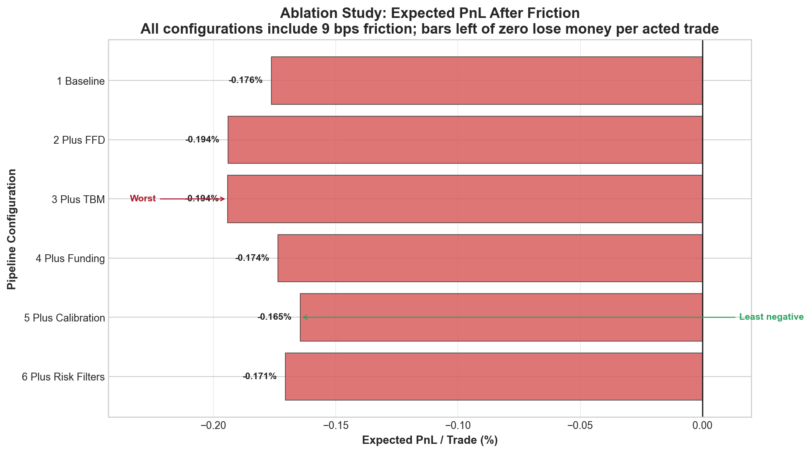
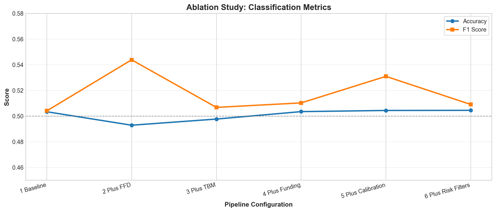
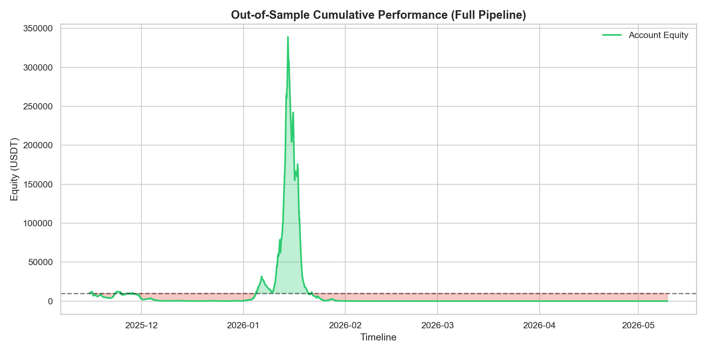
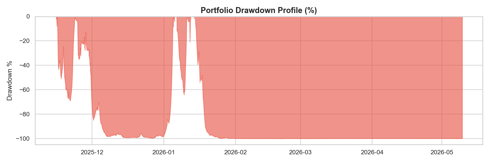
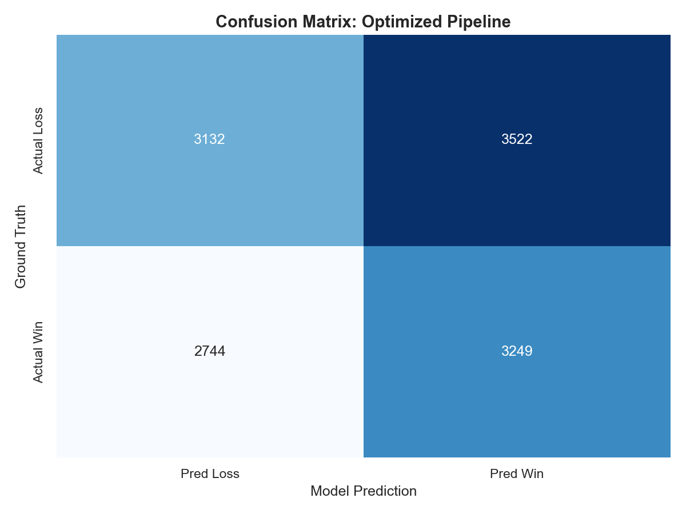

# 🛡️ Institutional Research Validation Report

## 📈 Executive Summary
This report details the rolling walk-forward validation of the AI Trading Bot. We evaluate out-of-sample performance through an **ablation study**, systematically adding layers of institutional realism to isolate the impact of each component (Fractional Differencing, Triple Barrier Method, Microstructure Features, Calibration, and Realistic Risk Filters).

## 🔬 1. Ablation Study
Adding complexity only makes sense if it improves metrics. We track Accuracy, F1 Score, and Expected PnL as we move from a simple baseline to the full institutional pipeline. The chart separates economics from classification scores because accuracy near 50% is not sufficient if expected PnL remains negative after friction.

### Expected PnL After Friction

### Classification Metrics

| Configuration | Accuracy | F1 Score | Brier | Trades | Win Rate | Exp. PnL |
|---|---|---|---|---|---|---|
| 1 Baseline | 0.5034 | 0.5041 | 0.2642 | 6672 | 47.84% | -0.1763% |
| 2 Plus FFD | 0.4929 | 0.5439 | 0.2796 | 8066 | 47.40% | -0.1941% |
| 3 Plus TBM | 0.4977 | 0.5068 | 0.2770 | 6887 | 47.39% | -0.1943% |
| 4 Plus Funding | 0.5035 | 0.5103 | 0.2815 | 6830 | 47.91% | -0.1737% |
| 5 Plus Calibration | 0.5044 | 0.5310 | 0.3452 | 7371 | 48.13% | -0.1646% |
| 6 Plus Risk Filters | 0.5045 | 0.5091 | 0.3452 | 6771 | 47.98% | -0.1706% |

## 📊 2. Performance Visualization
### Cumulative Equity Curve (Out-of-Sample)
The following chart shows the simulated growth of a $10,000 account using the final optimized configuration (Config 6).

### Drawdown Profile
Understanding risk is more important than understanding profit. This chart highlights the peak-to-trough declines during the validation period.

## 🎯 3. Model Diagnostics
### Confusion Matrix
A look at the raw classification performance for the final pipeline. We prioritize avoiding 'False Wins' (Type I errors) to preserve capital.

### Top 5 Maximum Drawdowns
| Start Date | End Date | Max Drawdown (%) |
|---|---|---|
| 2026-01-14 14:00:00 | 2026-05-09 21:00:00 | -100.00% |
| 2025-11-23 15:00:00 | 2026-01-04 23:00:00 | -99.67% |
| 2025-11-16 02:00:00 | 2025-11-23 14:00:00 | -69.09% |
| 2026-01-06 14:00:00 | 2026-01-10 21:00:00 | -64.19% |
| 2026-01-12 02:00:00 | 2026-01-12 13:00:00 | -20.91% |

## ⚠️ 4. Methodology & Limitations
- **Data Integrity:** Walk-forward validation was performed over a 1-year historical window (~8,760 hours). All features were computed causally to prevent look-ahead bias.
- **Execution Realism:** A static friction of **9 basis points (bps)** was applied (1bp slippage + 2bp spread + 6bp fees). Real-world slippage can vary significantly with liquidity.
- **Calibration:** Probability outputs are calibrated using Platt Scaling (Sigmoid) to ensure that confidence levels correspond to actual win frequencies.
- **Risk Warning:** Past performance does not guarantee future results. High drawdown periods in the out-of-sample data indicate significant volatility risks.
