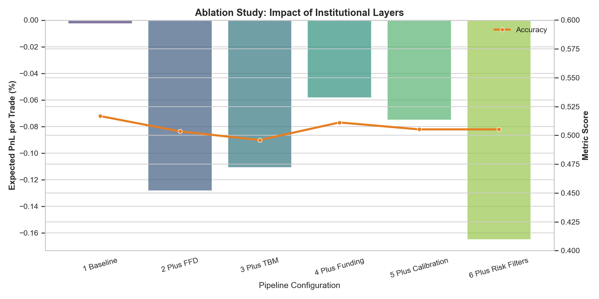

# 🛡️ Institutional Research Validation Report

## 📈 Executive Summary
This report details the rolling walk-forward validation of the AI Trading Bot. We evaluate out-of-sample performance through an **ablation study**, systematically adding layers of institutional realism to isolate the impact of each component (Fractional Differencing, Triple Barrier Method, Microstructure Features, Calibration, and Realistic Risk Filters).

## 🔬 1. Ablation Study
Adding complexity only makes sense if it improves metrics. We track Accuracy, F1 Score, and Expected PnL as we move from a simple baseline to the full institutional pipeline.

| Configuration | Accuracy | F1 Score | Brier | Trades | Win Rate | Exp. PnL |
|---|---|---|---|---|---|---|
| 1 Baseline | 0.5167 | 0.5259 | 0.2631 | 6588 | 51.46% | -0.0027% |
| 2 Plus FFD | 0.5034 | 0.5690 | 0.2816 | 8266 | 50.15% | -0.1282% |
| 3 Plus TBM | 0.4959 | 0.5064 | 0.2777 | 6924 | 47.23% | -0.1109% |
| 4 Plus Funding | 0.5112 | 0.5075 | 0.2776 | 6561 | 48.54% | -0.0582% |
| 5 Plus Calibration | 0.5052 | 0.5224 | 0.3379 | 7113 | 48.12% | -0.0751% |
| 6 Plus Risk Filters | 0.5052 | 0.5224 | 0.3379 | 7113 | 48.12% | -0.1651% |

## 📊 2. Performance Visualization
### Cumulative Equity Curve (Out-of-Sample)
The following chart shows the simulated growth of a $10,000 account using the final optimized configuration (Config 6).

### Drawdown Profile
Understanding risk is more important than understanding profit. This chart highlights the peak-to-trough declines during the validation period.

## 🎯 3. Model Diagnostics
### Confusion Matrix
A look at the raw classification performance for the final pipeline. We prioritize avoiding 'False Wins' (Type I errors) to preserve capital.

### Top 5 Maximum Drawdowns
| Start Date | End Date | Max Drawdown (%) |
|---|---|---|
| 2026-01-14 14:00:00 | 2026-05-09 20:00:00 | -100.00% |
| 2025-11-15 07:00:00 | 2026-01-05 09:00:00 | -99.78% |
| 2026-01-06 13:00:00 | 2026-01-11 07:00:00 | -72.05% |
| 2026-01-12 02:00:00 | 2026-01-12 12:00:00 | -19.40% |
| 2026-01-12 17:00:00 | 2026-01-12 20:00:00 | -4.35% |

## ⚠️ 4. Methodology & Limitations
- **Data Integrity:** Walk-forward validation was performed over a 1-year historical window (~8,760 hours). All features were computed causally to prevent look-ahead bias.
- **Execution Realism:** A static friction of **9 basis points (bps)** was applied (1bp slippage + 2bp spread + 6bp fees). Real-world slippage can vary significantly with liquidity.
- **Calibration:** Probability outputs are calibrated using Platt Scaling (Sigmoid) to ensure that confidence levels correspond to actual win frequencies.
- **Risk Warning:** Past performance does not guarantee future results. High drawdown periods in the out-of-sample data indicate significant volatility risks.
